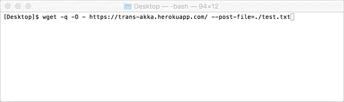
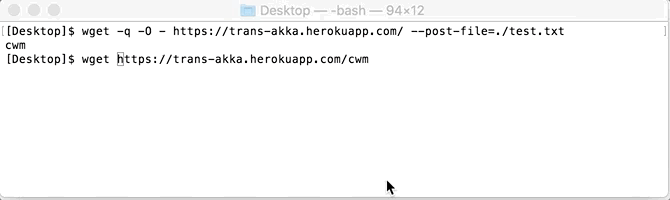

# trans - Transmit a file by only standard commands

Transmit files by using **only common Uninx/Linux commands, `curl` or `wget`**

| branch | Travis status| Coverage |
| --- | --- | --- |
| [`master`](https://github.com/nwtgck/trans-server-akka/tree/master) | [](https://travis-ci.org/nwtgck/trans-server-akka) | [](https://coveralls.io/github/nwtgck/trans-server-akka?branch=master) |
| [`develop`](https://github.com/nwtgck/trans-server-akka/tree/develop) | [](https://travis-ci.org/nwtgck/trans-server-akka) | [](https://coveralls.io/github/nwtgck/trans-server-akka?branch=develop) |


## Send a file by wget



## Download the file by wget



## Public Server on Heroku

https://trans-akka.herokuapp.com/


## Quick Start

You can send, download and delete a file by the following commands.

```
# Send a file
wget -q -O - https://trans-akka.herokuapp.com/ --post-file=./test.txt
```

```
# Downlaod the file
wget https://trans-akka.herokuapp.com/a7h
# ('a7h' is a File ID created after sending)
```

```
# Delete a file
wget -q -O - --method DELETE https://trans-akka.herokuapp.com/a7h
```


### Option explanations

* `-q`: No prgress bar
* `-O -`: Response to stdout


## Main features

* Send/Get by **only common commands**, `curl` or `wget`
* Send/Get **on your browser**
* Send/Get with restrictions
  - download key
  - store duration
  - how many times you can download
* Delete files you sent
  - without delete key
  - with delete key
* Change File ID length (for security)
* Encrypt and Compress file for security

## How to run the server

You can choose any ways you want bellow.

### Way 1 - Run on Docker

[](https://hub.docker.com/r/nwtgck/trans-server-akka/)

```bash
docker run -p 8080:80 nwtgck/trans-server-akka
```

Then you can go http://localhost:8080/

#### Docker run for daemonize and data persistence

You can also run the following command for **daemonize** and **data persistence**.

```bash
docker run -d -p 8080:80 -v $PWD/trans-db:/trans/db --restart=always nwtgck/trans-server-akka
```

Data will be stored in `$PWD/trans-db` on your host machine. (Currently file-base H2 database is used, and files sent are stored as compressed and encrypted files)

### Way 2 - sbt "run-main ..."

The following example runs a server on 80 port.
```sh
$ cd <this-project>
$ ./make-keystore.bash
$ sbt "run-main io.github.nwtgck.trans_server.Main --http-port=8282"
```

### Way 3 - Making a jar

#### 1. Make a keystore

```sh
$ cd <this-project>
$ ./make-keystore.bash
```


#### 2. Make a jar

```sh
$ cd <this-project>
$ sbt assembly
```
(It takes a time)

#### 3. Run the jar

```sh
$ java -jar target/scala-2.11/trans-server-akka.jar --http-port=8282 --https-port=4433
```

## How to send a file to the server

### Way 1 - curl

The following example is sending `../test.txt`

```
$ curl https://trans-akka.herokuapp.com/ --data-binary @../test.txt
```

#### output
```
ab2
```

The server response, `ab2` is a File ID to get `../test.txt`


### Way 2 - wget

The following example sends `../test.txt`

```sh
$ wget -q -O - https://trans-akka.herokuapp.com/ --post-file=../test.txt
```

* `-q` is for non-progress bar
* `-O -` is to output STDOUT  

#### output
```
9vi
```

The server response, `9vi` is a File ID to get `../test.txt`


### Way 3 - wc & cat & nc

**This way is for a user which can't use `curl` command.**

The following example sends `sounds.zip`.

#### 1. Get a file byte

```sh
$ wc -c  < sounds.zip
```


##### output
```
1161257298 # Use it later
```

#### 2. Create `header.txt`

```
POST / HTTP/1.1
Host: localhost:4343
Content-Length: 1161257298

```

Don't forget the end of `'\n'`

 #### 3. Send a file by HTTP request


```
$ cat header.txt sounds.zip | nc localhost 4343
```


 The response is bellow.
```
HTTP/1.1 200 OK
Server: akka-http/10.0.5
Date: Sun, 23 Apr 2017 04:22:32 GMT
Connection: close
Content-Type: text/plain; charset=UTF-8
Content-Length: 4

6oz
```

`6oz` is FILE ID.


## How to get a file from the server

### Way 1 - wget

```sh
$ wget https://trans-akka.herokuapp.com/ab2
```

`ab2` is a File ID.

### Way 2 - curl


```sh
$ curl https://trans-akka.herokuapp.com/ab2 > test.txt
```

`ab2` is a File ID.


### Way 3 - Using a Browser

Open `https://trans-akka.herokuapp.com/ab2` on your browser

`ab2` is a File ID.


## Sending-options

Here is options you can use when sending

|GET parameter | default value | decription |
|---|---:|---|
| `duration`    | 1 hour        | Store duration/life                                  |
| `get-times`   | infinite      | How many times you can download                      |
| `id-length`   | `3`           | Length of File ID                                    |
| `deletable`   | `true`        | Whether a file can be deleted                        |
| `delete-key`  | nothing       | Key for deletion                                     | 
| `secure-char` | `false`       | Whether more complex characters are used for File ID | 

### An example with options

```bash
wget -q -O - 'https://trans-akka.herokuapp.com/?duration=30s&get-times=1&id-length=16&delete-key=mykey1234&secure-char' --post-file=./hello.txt
```

The command means
* duration is 30 seconds
* download once
* File ID length is 16
* The file is deletable and key is `'mykey1234'`
* Use more complex characters for File ID

### Available duration examples
* `10s` - 10 seconds
* `2m`  - 2 minutes
* `12h` - 12 hours
* `25d` - 25 days

### Usage of `deletable`

All bellow are valid usages.

```bash
'https://trans-akka.herokuapp.com/?deletable'
# (same meaning as `deletable=true`)
```

```bash
'https://trans-akka.herokuapp.com/?deletable=true'
```

```bash
'https://trans-akka.herokuapp.com/?deletable=false'
```

### Set download key

```bash
curl -u dummy_user:mypass123 -T ./hello.txt  https://trans-akka.herokuapp.com
```

When you don't want to type key in command, you can use `-u dummy_user` instead of `-u dummy_user:mypass123`. Then, `curl` provide you a password prompt.

NOTE: `dummy_user` can be change any name including empty `''`.


### Get with download key

```bash
curl -u dummy_user:mypass123 https://trans-akka.herokuapp.com/yk2
```

NOTE: The server doesn't check user name. So, you can use any name for user name, not only `"dummy_user"`.


## Delete file

## delete without delete key

```bash
# wget version
wget -q -O - --method=DELETE 'https://trans-akka.herokuapp.com/vua'
```

```bash
# curl version
curl -X DELETE 'https://trans-akka.herokuapp.com/vua'
```
(`vua` is a File ID)

## delete with delete key

```bash
# wget version
wget -q -O - --method=DELETE 'https://trans-akka.herokuapp.com/6em?delete-key=1234'
```

```bash
# curl version
curl -X DELETE 'https://trans-akka.herokuapp.com/6em?delete-key=1234'
```

## My Note

[MYNOTE.md](MYNOTE.md)